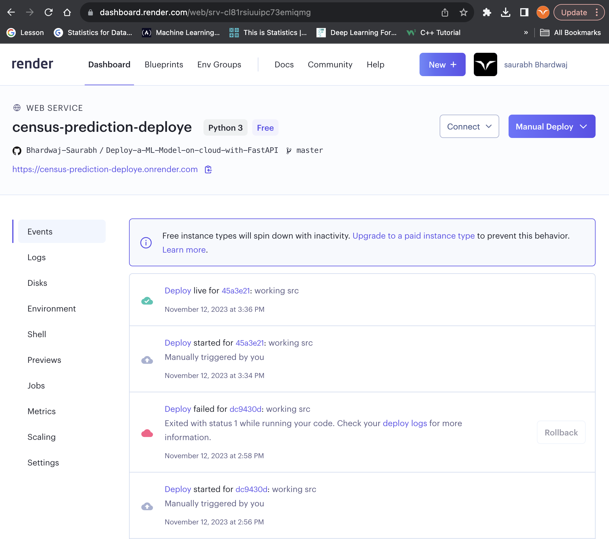
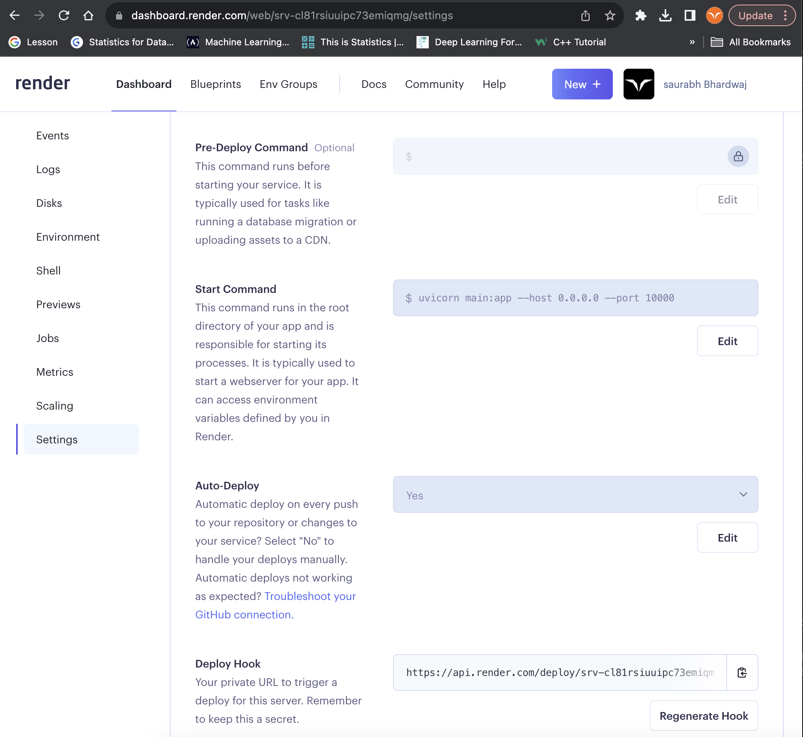
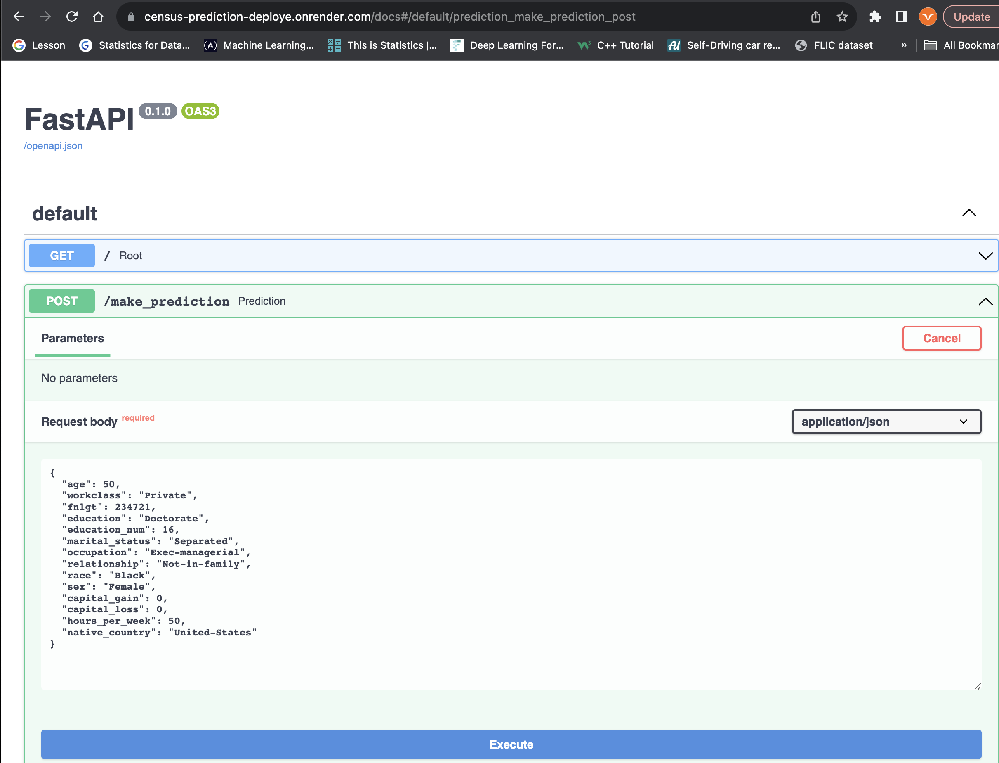

# Deploye_FastAPI_WebApp_on_Cloud

## Environment Set up
Download and install conda if you don’t have it already.

Run the following commends on terminal.

```
git clone https://github.com/Bhardwaj-Saurabh/Deploy-a-ML-Model-on-cloud-with-FastAPI.git
```

```
cd Deploy-a-ML-Model-on-cloud-with-FastAPI
```

```
conda create -n envn "python=3.8" 
```

```
conda activate envn
```

```
pip install -r requirements.txt
```

## Running Instruction

- To Train Model
```
python src/train_model.py
```

- To Run Test
```
pytest src/test_pipeline.py
```

- To Run the Web App Locally
```
uvicorn main:app
```

## Web App deployed on Render
Deployed App can be access [here](https://census-prediction-deploye.onrender.com/docs)


## Data
- Download census.csv from the data folder in the starter repository.
- Information on the dataset can be found here.
- This data is messy, try to open it in pandas and see what you get.
- To clean it, use your favorite text editor to remove all spaces.

## Model
- Using the starter code, write a machine learning model that trains on the clean data and saves the model. Complete any function that has been started.
- Write unit tests for at least 3 functions in the model code.
- Write a function that outputs the performance of the model on slices of the data.
- Suggestion: for simplicity, the function can just output the performance on slices of just the categorical features.
- Write a model card using the provided template.

## API Deployment to a Render Cloud Platform
- Create a Free Cloud Application Platform account, such as Render.

- Render Deployement 



- FAST API Preview


